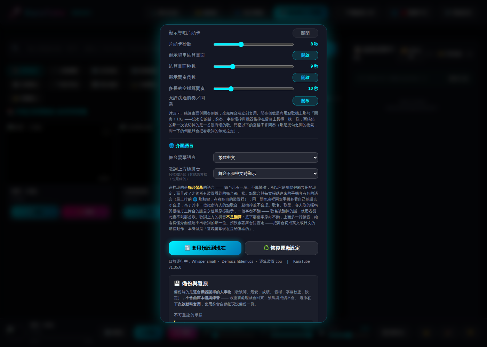
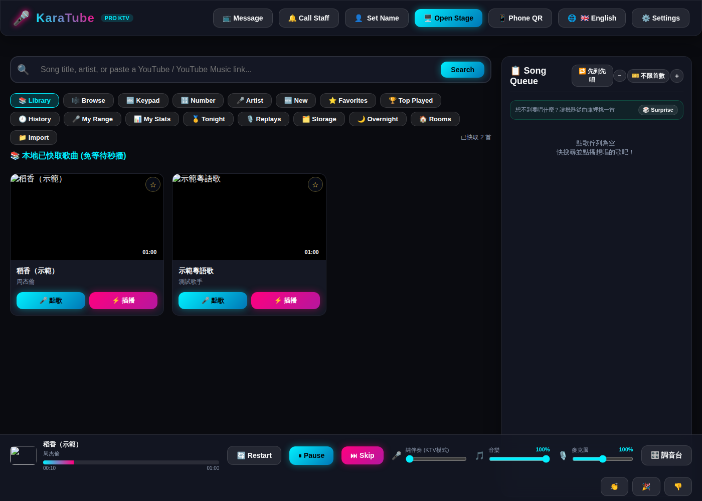

# KaraTube 測試與統計報告（v1.35.1）

測試日期：2026-10-06 ｜ 測試對象：`main` 合併提交 ba77ca0（v1.35.0）＋本報告附帶的修正（v1.35.1）

**結論：2,076 條自動測試全數通過、0 失敗**；實機測試發現 3 個畫面問題，其中 2 個已在 v1.35.1 修正，
1 個是路線圖上已列的下一輪工作。

## 1. 自動測試結果

| 檢查 | 範圍 | 結果 | 耗時（秒） |
| --- | --- | --- | --- |
| 後端單元／API 測試（pytest） | 44 個測試檔、1,318 條 | 1,316 通過、0 失敗、2 跳過 | 31.0 |
| 前端單元測試（node --test） | 37 個測試檔、760 條 | 760 通過、0 失敗 | 1.7 |
| Python lint（ruff） | 整個專案 | 0 個問題 | 0.8 |
| 語法檢查 | 83 個 JS 檔 + 全部 Python 源碼 | 全部通過 | — |
| 部署檔（docker compose config） | docker-compose.yml | 通過 | — |

環境：Python 3.11、Node 22、雲端容器（無 GPU）。兩條跳過是「沒裝 pypinyin 時功能安靜關閉」的反向測試，
裝了套件的環境本來就走不到。

GitHub Actions 本月配額用完，三個 job 停在 queued；上表是在本機照 `.github/workflows/ci.yml` 的同樣步驟重跑。

最佔時間的測試檔：`test_api`（266 條、12.0 秒）、`test_staff_lock`（3.2 秒，密碼雜湊刻意放慢）、
`test_loudness`（3.0 秒，EBU R128 響度計算）。

### v1.35 新增的 43 條

| 測試檔 | 條數 | 守的是什麼 |
| --- | --- | --- |
| `tests/test_ruby.py` | 23 | 只標國語歌、多音字靠詞組消歧、拼音與歌詞等長、歌詞換掉後指紋作廢 |
| `tests/test_api.py`（新增部分） | 4 | 拼音跟歌詞同一次回應、寫回磁碟、改歌詞後自動重算、沒有這首歌也不出錯 |
| `frontend/tests/ruby-layout.test.js` | 16 | 字級計算、放不下就不標、長度對不上整行不標、前後端模式清單一致 |

## 2. 實機測試

真的伺服器（`KARATUBE_CACHE_DIR` 指向一份示範曲庫、port 8765），以 Playwright 操作 Chromium。
示範曲庫兩首：一首國語、一首粵語，音訊為靜音。

| 情境 | 預期 | 結果 |
| --- | --- | --- |
| 舞台語言 English、`stage_ruby=auto`，播國語歌 | 歌詞上方出現拼音，跟著字一起變色 | 通過：22 個拼音節點，兩行都套上 `with-ruby` |
| 同上，舞台切回繁體中文 | 拼音消失、歌詞位置不跳 | 通過：拼音節點歸零 |
| `GET /api/songs/demo_cantonese_01/lyrics` | 不標華語讀音，並說明理由 | 通過：`available: false`、`unsupported_language` |
| `GET /api/songs/demo_mandarin_01/lyrics` | 多音字照詞組 | 通過：還記得 → hái jì dé |
| 點歌台跟著瀏覽器語言開成英文 | 骨架翻好 | 骨架通過；動態文字仍是中文（見問題 3） |
| 系統設定頁「🌐 介面語言」 | 新的一列可選三個模式 | 功能通過；顯示有問題（見問題 1、2） |


*舞台切成 English：第一行正在唱，拼音跟著字變色；「chéng」「xiāng」這類長音節自動縮小一號。*


*舞台切回繁體中文：auto 模式下拼音消失，歌詞不動。*



*系統設定頁（v1.35.1 修正後）：說明文字的重點以黃色粗體標出。*



*點歌台跟著瀏覽器語言開成英文：歌卡上的「點歌／插播」與佇列提示還是中文。*

### 發現的問題

| # | 問題 | 影響 | 處理 |
| --- | --- | --- | --- |
| 1 | 設定頁說明印出原始的 `**…**` 星號 | 12 段說明，從早期版本就存在 | v1.35.1 已修：星號轉成既有的黃色粗體樣式 |
| 2 | 拼音那一列的提示太長，在窄欄裡擠成七行 | 只有 v1.35 新增的那一列 | v1.35.1 已修：改成一句短提示 |
| 3 | 點歌台動態文字未翻譯 | 英文／日文介面混著中文 | 路線圖下一輪第一項（動態訊息三語化） |

## 3. 專案統計

一個月內（2026-09-07 → 10-06，main 上 38 次合併）測試函式從 244 個增加到 1,985 個（8.1 倍），
程式碼從 8,325 行增加到 41,510 行（5.0 倍）。

| 版本 | 合併日期 | 測試函式數 | 程式碼行數 |
| --- | --- | --- | --- |
| v1.35.0 | 2026-10-06 | 1,985 | 41,510 |
| v1.34.0 | 2026-10-05 | 1,942 | 40,870 |
| v1.30.0 | 2026-10-01 | 1,763 | 37,735 |
| v1.25.0 | 2026-09-26 | 1,439 | 31,736 |
| v1.20.0 | 2026-09-22 | 1,152 | 26,214 |
| v1.15.0 | 2026-09-18 | 899 | 21,882 |
| v1.10.0 | 2026-09-14 | 655 | 17,805 |
| v1.5.0 | 2026-09-10 | 436 | 12,858 |
| v1.0.0 | 2026-09-07 | 274 | 8,745 |

測試函式是靜態計數（pytest `def test_` + node `test()`），比 pytest 實際收集的少一些（參數化測試只算一次）；
程式碼行數是 `backend/**/*.py` + `frontend/js/*.js`。

**目前的程式碼分布**

| 區塊 | 檔案數 | 行數 |
| --- | --- | --- |
| 前端 JS（`frontend/js`） | 46 | 21,729 |
| 文件（README、CHANGELOG、`docs`） | 6 | 15,126 |
| 後端測試（`tests`） | 46 | 15,108 |
| 後端服務（`backend/services`） | 37 | 13,676 |
| 前端測試（`frontend/tests`） | 37 | 7,408 |
| 前端 HTML／CSS | 6 | 6,205 |
| API 入口與設定（`main.py` 等） | 3 | 3,272 |
| 處理流水線（`backend/pipeline`） | 9 | 2,492 |

HTTP API 端點 132 個；商用 KTV 功能對照清單已完成 73 項。

## 4. 怎麼重跑這份報告

```bash
pip install -r requirements-dev.txt
python -m pytest tests/ -q              # 後端
node --test "frontend/tests/*.test.js"  # 前端
ruff check .
```

實機截圖：以 `KARATUBE_CACHE_DIR=<示範曲庫> KARATUBE_PORT=8765 python run.py` 啟動，
POST `/api/settings` 把 `stage_locale` 設成 `en`、POST `/api/queue/add` 點一首國語歌，再開 `/player.html`。
